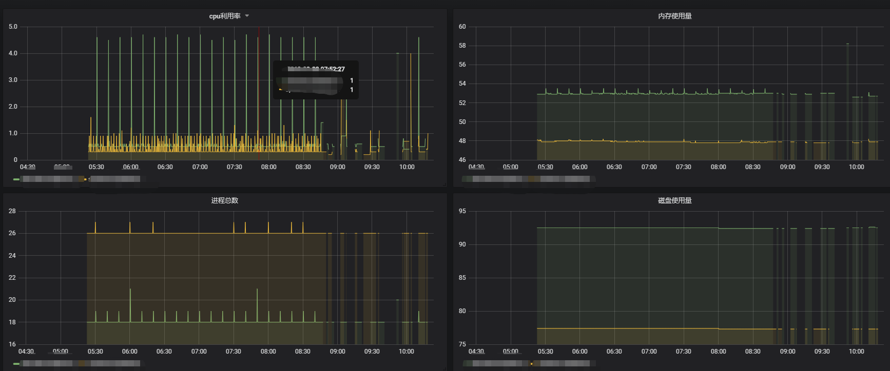

# process prometheus exporter

## usage

#### local
1. `pip install PyYAML psutil prometheus_client`
2. `python process_expoorter.py --config config.yaml`

#### vscode debug args
```json
"args": [
                "--config",
                "config.yaml"
            ],
```

#### package
1. `pip install PyInstaller`
2. `pyinstaller -F process_expoorter.py`


#### grafana



#### grafana json
[for import](process.json)
